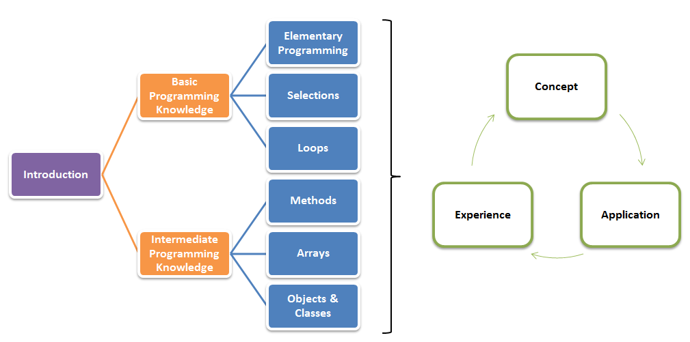
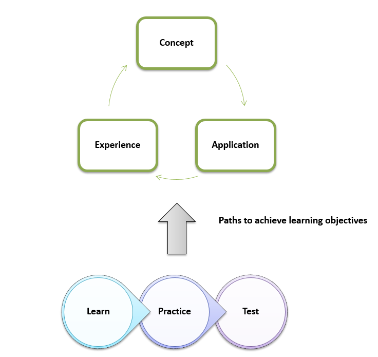

##CIS 3260 Session 009: Introduction to Programming

**This syllabus provides a general guideline for the conduct of this course. However, deviations will be necessary. It is students' reponsibility to check the syllabus regularly.**

### 1. Logistics
+ **Location**: Room 100-S, J. Mack Robinson College of Business, [Map](https://github.com/zhitaoyin/CIS3260/blob/master/Pic/ClassroomLocation.PNG)
+ **Time**: 4:30pm - 7:00pm, Monday
+ **Instructor**: [Zhitao Yin](http://zhitaoyin.com)
+ **Email**: zyin3@gsu.edu
+ **Office**: Room 428, 4th Floor, J. Mack Robinson College of Business, [Map](https://github.com/zhitaoyin/CIS3260/blob/master/Pic/OfficeLocation.PNG)
+ **Office Hour**: [Schedule](https://github.com/zhitaoyin/CIS3260/blob/master/Doc/Office%20Hour%20Schedule.md)

### 2. Learning Objectives - Change Your Way of Thinking and Seeing The World

 + **Concept**: Thoroughly understand the basic programming knowledge (i.e., elementary programming ,selections, and loops) as well as somewhat intermediate programming knowledge (i.e., methods, arrays, and objects & classes).
 + **Application**: Correctly apply these concepts to create, debug, execute, and test well-designed and readable applications in Java.
 + **Experience**: Creatively use programming thinking to identify a problem, break it into pieces, and write code to solve it.
 + **Impact**: The students are expected to see the forest beyond the trees (i.e., programming).
  + Briefly understand the most up-to-date technologies that are created by programming
  + Briefly understand the phenomenon that is shaped by those technologies.

### 3. Paths to Achieve The Learning Objectives

**Learn**
 
 + **Lecture**: 
  + Each lecture will introduce the ***core concepts*** in one topic and may include a demostration of how to ***apply*** the concepts to create, debug, execute, and test well-designed and readable applications in Java.
  + As the lecture is the main opportunity to learn, each student is expected to attend each lecture and activly interact with the instructor and fellow students during class discussion. Thus, ***attendence and interaction will be graded*** (See 4. Grading Policy for details.)
  + ***Lecture Slides*** will be available after each lecture on this website.
 + **Office Hour**: 
  + Office hour visit is ***highly recommended*** for the students who want to ***discuss concepts*** as these thoguhts are more difficult to grasp and require more information, discussion and time. Students may want to communicate with the instructor via email to ask questions regarding course logistics. 
  + [Office hour schedule](Doc/Office%20Hour%20Schedule.md) offers a general guideline for each office hour session. Students are ***welcome*** to ask other questions regarding the content of this course as well.
 + **Textbook**:
  +  Y. Daniel Liang，Introduction to Java programming, Comprehensive Version, 10th Edition [(Hardcopy Link on  Amazon.com)](https://www.amazon.com/Intro-Java-Programming-Comprehensive-Version/dp/0133761312/ref=sr_1_2?ie=UTF8&qid=1471567611&sr=8-2&keywords=Y.+Daniel+Liang%EF%BC%8CIntroduction+to+Java+programming)
  + Most content of the lecture will be based on the textbook. Thus, it is a good ***referece*** for students to ***prepare*** and ***review*** the class.
 + **See The Forest beyond The Trees**
  + 
 + **Online Learning Resources**: (additional ways for students to learn programming)
  + [edX](https://www.edx.org/) and [Coursera](https://www.coursera.org/), offer free online courses from the world's best universities including MIT, Harvard, Berkeley, UT and others. *(Type keyword "java" to search free courses.)*
  + [Stack Overflow](http://stackoverflow.com/), an online community to ask and answer programming questions.
  + [Youtube](https://www.youtube.com), a video platform. *(Type keywords to search video tutorials. For example, how to install Java and set up [Eclipse](https://www.eclipse.org/downloads/eclipse-packages/) for [Java](https://java.com/en/) on your computer.)*
  + [Google](https://www.google.com/), a search engine.

 
**Practice**

 + **Lab Session**: 
  +  
 + **Assignment**:
 + **Project**:
 
**Test**

 + **Midterm Exam**:
 + **Final Exam**:

### 4. Grading Policy

### 5. Schedule
 + **10.11 is the Fall 2016 semester midopint and the last day to withdraw the class.**
 + Click the hyperlink of each topic to see its corresponding materials.
 + Click the hyperlink of each assignment to see its corresponding materials.
 + Click the hyperlink of each project to see its corresponding materials.
 
| Lecture | Date  | Topic                         | Assignment                             | Project |
|:-------:|:-----:| :----------------------------:|:--------------------------------------:|:-------:|
| 1       | 08.22 | Introduction                  | Assignment 1 out. Due 08.27 at 11:55pm |  |  
| 2       | 08.29 | Elementary Programming        | Assignment 2 out. Due 09.03 at 11:55pm |  |
|         | 09.05 | **Labor Day, No Class**           |                                        |  |
| 3       | 09.12 | Selections                    | Assignment 3 out. Due 09.17 at 11:55pm |  |
| 4       | 09.19 | Selections                    | Assignment 4 out. Due 09.24 at 11:55pm |  |
| 5       | 09.26 | Loops                         | Assignment 5 out. Due 10.01 at 11:55pm |  |
| 6       | 10.03 | Loops                         | Assignment 6 out. Due 10.08 at 11:55pm |  |
|         | 10.10 | ***Midterm Exam***                  |                                        |  |
| 7       | 10.17 | Methods                       | Assignment 7 out. Due 10.22 at 11:55pm |  |
| 8       | 10.24 | Methods                       |                                        | Project Part 1 out. Due 10.29 at 11:55pm  |
| 9       | 10.31 | Single Dimentional Arrays     | Assignment 8 out. Due 11.05 at 11:55pm |  |
| 10      | 11.07 | Single Dimentional Arrays     |                                        | Project Part 2 out. Due 11.12 at 11:55pm |
| 11      | 11.14 | Multidimentionsional Arrays   |                                        | Project Part 3 out. Due 11.19 at 11:55pm |
|         | 11.21 | **Thanksgiving Break, No Class**  |                                        |  |
| 12      | 11.28 | Objects & Classes and Wrap-up |                                        |  |
|         | 12.05 | ***Final Exam***                    |                                        |  |

### RCB Professionalism Expectation
### Academic Honesty
### Miscellaneous

