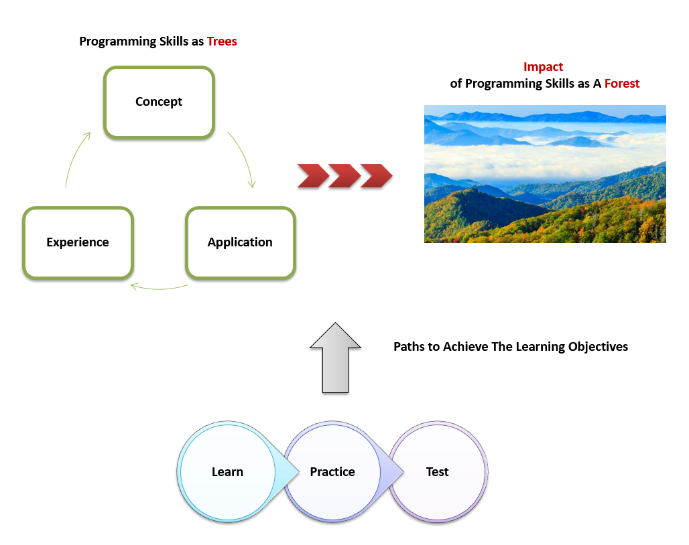
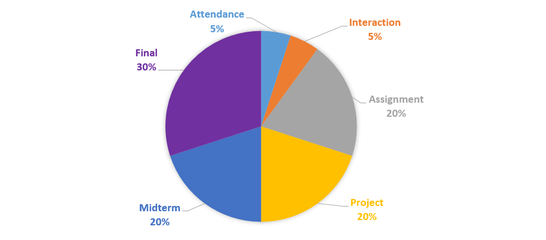
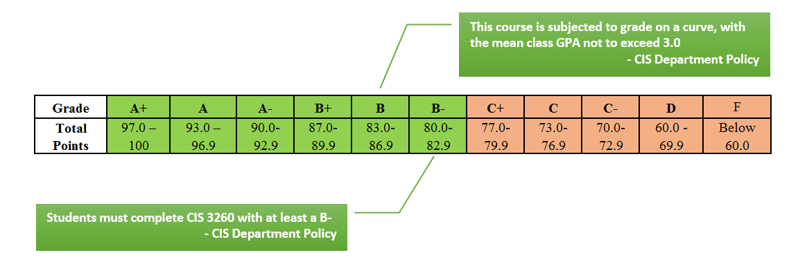

##CIS 3260 Session 009: Introduction to Programming

**This syllabus provides a general guideline for the conduct of this course. However, deviations will be necessary. It is students' responsibility to check the syllabus regularly.**

### 1. Logistics
+ **Location**: Room 100-S, J. Mack Robinson College of Business, [Map](Pic/ClassroomLocation.PNG)
+ **Time**: 4:30pm - 7:00pm, Monday
+ **Instructor**: [Zhitao Yin](http://zhitaoyin.com)
+ **Email**: zyin3@gsu.edu, *please do not use iCollege to communicate with the instructor*
+ **Office**: Room 428, 4th Floor, J. Mack Robinson College of Business, [Map](Pic/OfficeLocation.PNG)
+ **Office Hour**: [Schedule](Doc/Office%20Hour%20Schedule.md)

### 2. Learning Objectives - Change Your Way of Thinking about and Interacting with The World

 + **Concept**: Thoroughly understand the basic programming knowledge (i.e., elementary programming, selections, and loops) as well as somewhat intermediate programming knowledge (i.e., methods, arrays, and objects & classes).
 + **Application**: Correctly apply these concepts to create, debug, execute, and test well-designed and readable applications in Java.
 + **Experience**: Creatively use computational thinking to identify a problem, break it into pieces, and write code to solve it.
 + **Impact**: Briefly understand the most up-to-date technologies that are created by programming and the phenomena that are shaped by those technologies.

### 3. Paths to Achieve The Learning Objectives

**Learn**
 
 + **Lecture**: 
 
  + Each lecture will introduce the ***core concepts*** in one topic and may include a demonstration of how to ***apply*** the concepts to create, debug, execute, and test well-designed and readable applications in Java.
  + As the lecture is the main opportunity to learn, each student is expected to attend each lecture and actively interact with the instructor and classmates during class discussion. Thus, ***attendance and interaction will be graded*** (see **4. Grading Policy** for details).
  + ***Lecture Slides*** will be available after each lecture on this website.
  + No audio recording, video recording, or photography is allowed without instructor's permission.
 + **Office Hour**: 
  + Office hour visit is ***highly recommended*** for the students who want to ***discuss concepts*** as these thoughts are more difficult to grasp and require more information, discussion and time. Students may want to communicate with the instructor via email to ask questions regarding course logistics. 
  + [Office hour schedule](Doc/Office%20Hour%20Schedule.md) offers a general guideline for each office hour session. Students are ***welcome*** to ask other questions regarding the content of this course as well.
  + No audio recording, video recording, or photography is allowed without instructor's permission.
 + **Textbook**:
  +  Y. Daniel Liang，Introduction to Java Programming, Comprehensive Version, 10th Edition ([Hardcopy link on  Amazon.com](https://www.amazon.com/Intro-Java-Programming-Comprehensive-Version/dp/0133761312/ref=sr_1_2?ie=UTF8&qid=1471567611&sr=8-2&keywords=Y.+Daniel+Liang%EF%BC%8CIntroduction+to+Java+programming), [PDF link](http://www2.sunysuffolk.edu/tangy/cst112.html))
  + Most content of the lecture will be based on the textbook. Thus, it is a good ***reference*** for students to ***prepare*** and ***review*** the class.
 + **See The Forest Beyond The Trees**:
  + This module is designed to empower students to critically think about the big picture - the impact of programming.
  + Starting from Lecture 2, the instructor will allocate 10 mins to briefly introduce the most up-to-date technologies that are created by programming or the phenomena that are shaped by those technologies in each lecture.
  + The students are expected to (1) watch videos and/or read articles after class, and (2) discuss the questions assigned by the instructor with classmates after class.
  + This module will be tested in the midterm and final exam.
 + **Online Learning Resources**: (additional ways for students to learn programming)
  + [edX](https://www.edx.org/) and [Coursera](https://www.coursera.org/), offer free online courses from the world's best universities including MIT, Harvard, Berkeley, UT and others. *(Type keyword "java" to search free courses.)*
  + [Stack Overflow](http://stackoverflow.com/), an online community to ask and answer programming questions.
  + [Youtube](https://www.youtube.com), a video platform. *(Type keywords to search video tutorials. For example, how to install Java and set up [Eclipse](https://www.eclipse.org/downloads/eclipse-packages/) for [Java](https://java.com/en/) on your computer.)*
  + [Google](https://www.google.com/), a search engine.

 
**Practice**

You already know how Microsoft was founded. Bill Gates and Paul Allen dropped out of college to form the company in 1975. It’s that simple: Drop out of college, start a company, and become a billionaire, right? Wrong. Further study reveals that Gates and Allen had thousands of hours of programming practice prior to founding Microsoft. - ["10,000 Hours of Practice"](http://www.wisdomgroup.com/blog/10000-hours-of-practice/)

 + **Lab Session**: 
 
  + Lab session is ***highly recommended*** as it provides opportunities to ***digest and practice*** what the instructor teach in the lecture.
  + Time: Wednesday 2:30 - 4:00 PM and Friday 1:00 - 2:30 PM
  + Location: Room 100-S, J. Mack Robinson College of Business, [Map](Pic/ClassroomLocation.PNG)
 
 + **Assignment**:
 
  + The assignment is designed to (1) reinforce students' understanding of the key concepts of programming, and (2) develop students' capabilities to correctly apply these concepts to create, debug, execute, and test well-designed and readable applications in Java. 
  + All assignments will be posted on this website (see **5. Schedule** for details).
  + Each student is expected to complete and submit his or her assignments in the allocated time (see **5. Schedule** for details). All assignments will be graded (see **4. Grading Policy** for details).
  + ***No late submission of an assignment will be accepted. An assignment that is past the due date will be given zero.***
  + All files must be submitted through the corresponding assignment dropbox in [iCollege](http://icollege.gsu.edu), see [the instruction of how to submit a file to iCollege](Doc/iCollegeInstruction.md). 
  + ***Submission through email is not accepted***. 
  + Make sure to submit all required files specified in the assignment. It is each student's responsibility to check the completeness of the files after the submission. ***An assignment with missing files will be graded with 50% penalty.***
  + Discussion of assignment solutions is highly recommended, but each student must turn in his or her work. ***Plagiarism or duplicate  assignments will be given zero, a point deduction equivalent to one final grade level (i.e. from a B- to a C-), and a charge of academic dishonesty.  Both the student copying the assignment and the student supplying the copy will be penalized equally.***

 + **Project**:
 
  + The project is designed to give students' hands-on experience to creatively use programming thinking to identify a problem, break it into pieces, and write code to solve it. 
  + The project will include three modules and will be posted on this website (see **5. Schedule** for details).
  + Each student is expected to complete and submit his or her project in the allocated time (see **5. Schedule** for details). Each module will be graded (see **4. Grading Policy** for details).
  + ***No late submission of a module will be accepted. A module that is past the due date will be given zero.***
  + All files must be submitted through the corresponding project dropbox in [iCollege](http://icollege.gsu.edu), see [the instruction of how to submit a file to iCollege](Doc/iCollegeInstruction.md). 
  + ***Submission through email is not accepted***. 
  + Make sure to submit all required files specified in the project module. It is each student's responsibility to check the completeness of the files after the submission. ***A module with missing files will be graded with 50% penalty.***
  + Discussion of project solutions is highly recommended, but each student must turn in his or her work. ***Plagiarism or duplicate  assignments will be given zero, a point deduction equivalent to one final grade level (i.e. from a B- to a C-), and a charge of academic dishonesty.  Both the student copying the assignment and the student supplying the copy will be penalized equally.***

**Test**

 + Exams are designed to test (1) students' understanding of the key concepts of programming, (2) their capabilities to correctly apply these concepts to create, debug, execute, and test well-designed and readable applications in Java, and (3) their critical thinking about the most up-to-date technologies that are created by programming and the phenomena that are shaped by those technologies.
 + There will be one midterm exam (2.5 hours) and one final exam (2.5 hours).
 + All exams will be graded (see **4. Grading Policy** for details).
 + Make-up exams will ***not*** be given. 
  + Students missing an exam will receive a zero on that exam.  
  + Exams may be taken early if the instructor is given a legitimate reason (jury duties, religious holiday, scheduled surgeries, pregnancy, etc.). 
  + Proof of reasons must be scanned and sent to the instructor ahead of time (unless absence was due to a legitimate emergency, in which case scanned proof must be sent afterward).
 + Exams will be closed-book.
  + No cheat(note) sheet is allowed to use during exams.
  + No electronic device (e.g., cellphone, laptop) is allowed to use during exams.
 + Bathroom Break (CIS Department Policy)
  + A bathroom break is allowed ***before*** the start of the exam.
  + Each student must come forward to request bathroom break and leave instructor his/her exam and cell phone(s) during the exam.
  + Each student is allowed for max 5 minutes bathroom break during the exam. When the limit is expired, the student is then treated as turning in his/her exam and is not allowed to resume the exam.
 + Each student will receive an electronic version of his or her exam with grade and instructor's comments. The paper version is kept on file with the CIS Department for future reference.

### 4. Grading Policy

### 5. Schedule

 + **October 11 is the midpoint of the Fall 2016 semester and the last day to withdraw the class.**

| Lecture | Date  | Lecture Topic                 |See The Forest Beyond The Trees|  Assignment     | Project |
|:-------:|:-----:| :----------------------------:|:-:|:--------------------------------------:|:-------:|
| 1       | 08.22 | [Introduction](https://goo.gl/5ZlFLb)                  || [Assignment 1 out](Assignment/Assignment1.md). Due 08.27 at 11:55pm |  |
| 2       | 08.29 | Elementary Programming        || Assignment 2 out. Due 09.03 at 11:55pm |  |
|         | 09.05 | **Labor Day, No Class**       ||                                        |  |
| 3       | 09.12 | Selections                    || Assignment 3 out. Due 09.17 at 11:55pm |  |
| 4       | 09.19 | Selections                    || Assignment 4 out. Due 09.24 at 11:55pm |  |
| 5       | 09.26 | Loops                         || Assignment 5 out. Due 10.01 at 11:55pm |  |
| 6       | 10.03 | Loops                         || Assignment 6 out. Due 10.08 at 11:55pm |  |
|         | 10.10 | ***Midterm Exam***            ||                                        |  |
| 7       | 10.17 | Methods                       || Assignment 7 out. Due 10.22 at 11:55pm |  |
| 8       | 10.24 | Methods                       ||                                        | Project Module 1 out. Due 10.29 at 11:55pm  |
| 9       | 10.31 | Single Dimensional Arrays     || Assignment 8 out. Due 11.05 at 11:55pm |  |
| 10      | 11.07 | Single Dimensional Arrays     ||                                        | Project Module 2 out. Due 11.12 at 11:55pm |
| 11      | 11.14 | Multidimentionsional Arrays   ||                                        | Project Module 3 out. Due 11.19 at 11:55pm |
|         | 11.21 | **Thanksgiving Break, No Class**  ||                                        |  |
| 12      | 11.28 | Objects & Classes and Wrap-up ||                                        |  |
|         | 12.05 | ***Final Exam***                    ||                                        |  

### 6. RCB Professionalism Expectation

Developing professionalism is one of the skills that the Robinson experience emphasizes. The degree of professionalism that you develop in all of your interactions in the GSU community will impact your ability to achieve your goals both in Robinson and in your career. This is true whether you are in a for-profit business, a nonprofit organization, government, or any other context where the organization’s goals are tied to your goals.

In setting out the professionalism standards for Robinson College, an alignment with the real world workplace is always in mind. These standards may be significantly different from what your current habits are. That’s fine; that’s part of why you are here. Developing new habits of professionalism in our everyday interactions, both inside and outside the classroom, is part of what will give you the Robinson advantage.

[A Complete Version of RCB Professionalism Expectation](Doc/ProfessionalismExpectation.md)
### 7. Academic Honesty

University regulations will be enforced regarding dishonorable or unethical conduct (Cheating, Plagiarism, Falsification, Unauthorized Collaboration or Multiple Submissions). The penalties for incidents of academic dishonesty can lead to ***expulsion*** from the University. In this class, there will be ***zero tolerance*** for dishonorable or unethical conduct. Electronic or physical sharing of answers will be considered cheating and will not be tolerated.
 
Cheating on examinations involves giving or receiving unauthorized help before, during, or after an examination. Examples of unauthorized help include sharing information with another student during an examination, intentionally allowing another student to view one’s own examination, and collaboration before or after an examination which is specifically forbidden by the instructor.
 
Submission for academic credit of a work product, or a part thereof, represented as its being one’s own effort, which has been developed in substantial collaboration with assistance from another person or source, or computer-based resource, is a violation of academic honesty. It is also a violation of academic honesty to knowingly provide such assistance.  
 
If a student is charged with Academic Dishonesty, for each charge, a zero (0) with be given for the assignment, a minimum of point equivalent of one final grade (i.e. B- to a C-) will be deducted from the final course total points and a written Notice of Academic Dishonesty will be given to the Dean’s office. The student will also receive a copy of the notice. 
All assignments, project modules and exams are to be completed by the student alone. 
Copy work from the Internet without a proper reference will be considered plagiarism and subject to disciplinary action as delineated in the Student Handbook. 

For more information, see [Student Code of Conduct and Administrative Policies and Procedures](http://codeofconduct.gsu.edu/files/2016/08/Georgia-State-University_Student-Code-of-Conduct-20162017_08172016.pdf).

### 8. Miscellaneous

**Prerequisites**

Prerequisites are strictly enforced. Students failing to complete a prerequisite with a grade of “C” or higher will be administratively withdrawn from the course in which they are in violation with a loss of tuition fees. There are no exceptions. 

**Withdrawing**

A 'W' grade will be assigned if a student withdraws before the middle of the semester while maintaining a passing grade.  A 'WF' will be assigned if a student withdraws before the middle of the semester while doing failing work OR after the middle of the semester.

**Submission**

A copy of student work is kept on file with the CIS Department for future reference.

